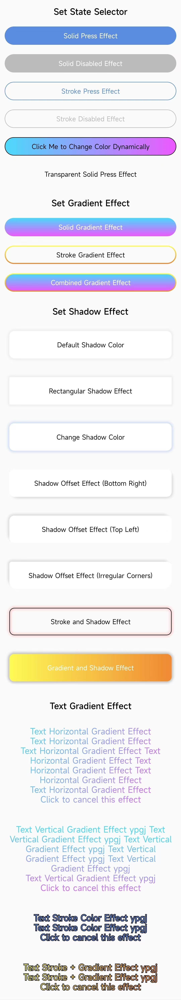

# [中文文档](README.md)

# ShapeView Framework

* Project address: [Github](https://github.com/getActivity/ShapeView)

* [Click here to download demo apk directly](https://www.jianshu.com/p/1288d8873440)

* You can scan the code to download the Demo for demonstration or testing. If you can't download it by scanning, [click here to download directly](https://github.com/getActivity/ShapeView/releases/download/10.0/ShapeView.apk)



#### Integration Steps

* If your project's Gradle version is `below 7.0`, you need to add the following in the `build.gradle` file

```groovy
allprojects {
    repositories {
        // JitPack remote repository: https://jitpack.io
        maven { url 'https://jitpack.io' }
    }
}
```

* If your Gradle version is `7.0 or above`, you need to add the following in the `settings.gradle` file

```groovy
dependencyResolutionManagement {
    repositories {
        // JitPack remote repository: https://jitpack.io
        maven { url 'https://jitpack.io' }
    }
}
```

* After configuring the remote repository, add the remote dependency in the `build.gradle` file under the app module

```groovy
android {
    // Support JDK 1.8
    compileOptions {
        targetCompatibility JavaVersion.VERSION_1_8
        sourceCompatibility JavaVersion.VERSION_1_8
    }
}

dependencies {
    // ShapeView: https://github.com/getActivity/ShapeView
    implementation 'com.github.getActivity:ShapeView:10.0'
    // ShapeDrawable: https://github.com/getActivity/ShapeDrawable
    implementation 'com.github.getActivity:ShapeDrawable:3.3'
}
```

#### AndroidX Compatibility

* If your project is based on the **AndroidX** library, please add the following configuration in the project's `gradle.properties` file. If it is already added, you can ignore this step.

```text
# Indicates using AndroidX
android.useAndroidX = true
# Indicates migrating third-party libraries to AndroidX
android.enableJetifier = true
```

* If your project is based on the **Support** library, you do not need to add this configuration

#### Framework Documentation

* Java code settings

```java
ShapeButton shapeButton = findViewById(R.id.btn_main_test);
shapeButton.setOnClickListener(new View.OnClickListener() {
    @Override
    public void onClick(View v) {
    
        shapeButton.getShapeDrawableBuilder()
                .setSolidColor(0xFF000000)
                .setStrokeColor(0xFF5A8DDF)
                // Note: You need to call intoBackground at the end to take effect
                .intoBackground();

        shapeButton.getTextColorBuilder()
                .setTextColor(0xFFFFFFFF)
                // Note: You need to call intoTextColor at the end to take effect
                .intoTextColor();

        shapeButton.setText("The color has changed");
    }
});
```

#### Full List of Layout Attributes

* [For xml attribute adaptation in different versions, please click here](Adaptive-en.md)

```xml
<resources>

    <!-- Shape type (default is rectangle) -->
    <attr name="shape_type">
        <!-- Rectangle -->
        <enum name="rectangle" value="0" />
        <!-- Oval -->
        <enum name="oval" value="1" />
        <!-- Line -->
        <enum name="line" value="2" />
        <!-- Ring -->
        <enum name="ring" value="3" />
    </attr>
    
    <!-- Shape width -->
    <attr name="shape_width" format="dimension" />
    <!-- Shape height -->
    <attr name="shape_height" format="dimension" />

    <!-- Corner radius -->
    <attr name="shape_radius" format="dimension" />
    <!-- Top left corner radius -->
    <attr name="shape_radiusInTopLeft" format="dimension" />
    <attr name="shape_radiusInTopStart" format="dimension" />
    <!-- Top right corner radius -->
    <attr name="shape_radiusInTopRight" format="dimension" />
    <attr name="shape_radiusInTopEnd" format="dimension" />
    <!-- Bottom left corner radius -->
    <attr name="shape_radiusInBottomLeft" format="dimension" />
    <attr name="shape_radiusInBottomStart" format="dimension" />
    <!-- Bottom right corner radius -->
    <attr name="shape_radiusInBottomRight" format="dimension" />
    <attr name="shape_radiusInBottomEnd" format="dimension" />

    <!-- Solid color (default state) -->
    <attr name="shape_solidColor" format="color" />
    <!-- Solid color (pressed state) -->
    <attr name="shape_solidPressedColor" format="color" />
    <!-- Solid color (checked state) -->
    <attr name="shape_solidCheckedColor" format="color" />
    <!-- Solid color (disabled state) -->
    <attr name="shape_solidDisabledColor" format="color" />
    <!-- Solid color (focused state) -->
    <attr name="shape_solidFocusedColor" format="color" />
    <!-- Solid color (selected state) -->
    <attr name="shape_solidSelectedColor" format="color" />

    <!-- Solid gradient start color -->
    <attr name="shape_solidGradientStartColor" format="color" />
    <!-- Solid gradient center color (optional) -->
    <attr name="shape_solidGradientCenterColor" format="color" />
    <!-- Solid gradient end color -->
    <attr name="shape_solidGradientEndColor" format="color" />

    <!-- Solid gradient orientation (only for linear gradient) -->
    <attr name="shape_solidGradientOrientation" >
        <!-- Gradient from left to right (0 degrees) -->
        <enum name="leftToRight" value="0" />
        <enum name="startToEnd" value="10" />

        <!-- Gradient from right to left (180 degrees) -->
        <enum name="rightToLeft" value="180" />
        <enum name="endToStart" value="1800" />

        <!-- Gradient from bottom to top (90 degrees) -->
        <enum name="bottomToTop" value="90" />
        <!-- Gradient from top to bottom (270 degrees) -->
        <enum name="topToBottom" value="270" />

        <!-- Gradient from top left to bottom right (315 degrees) -->
        <enum name="topLeftToBottomRight" value="315" />
        <enum name="topStartToBottomEnd" value="3150" />

        <!-- Gradient from bottom left to top right (45 degrees) -->
        <enum name="bottomLeftToTopRight" value="45" />
        <enum name="bottomStartToTopEnd" value="450" />

        <!-- Gradient from top right to bottom left (225 degrees) -->
        <enum name="topRightToBottomLeft" value="225" />
        <enum name="topEndToBottomStart" value="2250" />

        <!-- Gradient from bottom right to top left (135 degrees) -->
        <enum name="bottomRightToTopLeft" value="135" />
        <enum name="bottomEndToTopStart" value="1350" />
    </attr>
    <!-- Solid gradient type (default is linear gradient) -->
    <attr name="shape_solidGradientType">
        <!-- Linear gradient -->
        <enum name="linear" value="0" />
        <!-- Radial gradient -->
        <enum name="radial" value="1" />
        <!-- Sweep gradient -->
        <enum name="sweep"  value="2" />
    </attr>
    <!-- Solid gradient center X position (default is 0.5) -->
    <attr name="shape_solidGradientCenterX" format="float|fraction" />
    <!-- Solid gradient center Y position (default is 0.5) -->
    <attr name="shape_solidGradientCenterY" format="float|fraction" />
    <!-- Solid gradient radius (only for radial gradient) -->
    <attr name="shape_solidGradientRadius" format="float|fraction|dimension" />

    <!-- Stroke color (default state) -->
    <attr name="shape_strokeColor" format="color" />
    <!-- Stroke color (pressed state) -->
    <attr name="shape_strokePressedColor" format="color" />
    <!-- Stroke color (checked state) -->
    <attr name="shape_strokeCheckedColor" format="color" />
    <!-- Stroke color (disabled state) -->
    <attr name="shape_strokeDisabledColor" format="color" />
    <!-- Stroke color (focused state) -->
    <attr name="shape_strokeFocusedColor" format="color" />
    <!-- Stroke color (selected state) -->
    <attr name="shape_strokeSelectedColor" format="color" />

    <!-- Stroke gradient start color -->
    <attr name="shape_strokeGradientStartColor" format="color" />
    <!-- Stroke gradient center color (optional) -->
    <attr name="shape_strokeGradientCenterColor" format="color" />
    <!-- Stroke gradient end color -->
    <attr name="shape_strokeGradientEndColor" format="color" />

    <!-- Stroke gradient orientation (only for linear gradient) -->
    <attr name="shape_strokeGradientOrientation" >
        <!-- Gradient from left to right (0 degrees) -->
        <enum name="leftToRight" value="0" />
        <enum name="startToEnd" value="10" />

        <!-- Gradient from right to left (180 degrees) -->
        <enum name="rightToLeft" value="180" />
        <enum name="endToStart" value="1800" />

        <!-- Gradient from bottom to top (90 degrees) -->
        <enum name="bottomToTop" value="90" />
        <!-- Gradient from top to bottom (270 degrees) -->
        <enum name="topToBottom" value="270" />

        <!-- Gradient from top left to bottom right (315 degrees) -->
        <enum name="topLeftToBottomRight" value="315" />
        <enum name="topStartToBottomEnd" value="3150" />

        <!-- Gradient from bottom left to top right (45 degrees) -->
        <enum name="bottomLeftToTopRight" value="45" />
        <enum name="bottomStartToTopEnd" value="450" />

        <!-- Gradient from top right to bottom left (225 degrees) -->
        <enum name="topRightToBottomLeft" value="225" />
        <enum name="topEndToBottomStart" value="2250" />

        <!-- Gradient from bottom right to top left (135 degrees) -->
        <enum name="bottomRightToTopLeft" value="135" />
        <enum name="bottomEndToTopStart" value="1350" />
    </attr>

    <!-- Stroke size -->
    <attr name="shape_strokeSize" format="dimension" />
    <!-- Stroke dash size (0 for solid line, greater than 0 for dashed line) -->
    <attr name="shape_strokeDashSize" format="dimension" />
    <!-- Stroke dash gap (gap between dashes) -->
    <attr name="shape_strokeDashGap" format="dimension" />

    <!-- Shadow size -->
    <attr name="shape_shadowSize" format="dimension" />
    <!-- Shadow color -->
    <attr name="shape_shadowColor" format="color" />
    <!-- Shadow horizontal offset -->
    <attr name="shape_shadowOffsetX" format="dimension" />
    <!-- Shadow vertical offset -->
    <attr name="shape_shadowOffsetY" format="dimension" />

    <!-- Inner ring radius (only effective when shape="ring") -->
    <attr name="shape_ringInnerRadiusSize" format="dimension" />
    <!-- Inner ring radius ratio (only effective when shape="ring"), formula: whole ring / innerRadiusRatio = innerRadius -->
    <attr name="shape_ringInnerRadiusRatio" format="float" />
    <!-- Outer ring thickness (only effective when shape="ring") -->
    <attr name="shape_ringThicknessSize" format="dimension" />
    <!-- Outer ring thickness ratio (only effective when shape="ring"), formula: whole ring / thicknessRatio = thickness -->
    <attr name="shape_ringThicknessRatio" format="float" />

    <!-- Line gravity (only effective when shape="line") -->
    <attr name="shape_lineGravity">
        <flag name="top" value="0x30" />
        <flag name="bottom" value="0x50" />
        <flag name="left" value="0x03" />
        <flag name="right" value="0x05" />
        <flag name="start" value="0x00800003" />
        <flag name="end" value="0x00800005" />
        <flag name="center" value="0x11" />
    </attr>

    <!-- Text color (default state) -->
    <attr name="shape_textColor" format="color" />
    <!-- Text color (pressed state) -->
    <attr name="shape_textPressedColor" format="color" />
    <!-- Text color (checked state) -->
    <attr name="shape_textCheckedColor" format="color" />
    <!-- Text color (disabled state) -->
    <attr name="shape_textDisabledColor" format="color" />
    <!-- Text color (focused state) -->
    <attr name="shape_textFocusedColor" format="color" />
    <!-- Text color (selected state) -->
    <attr name="shape_textSelectedColor" format="color" />

    <!-- Text gradient start color -->
    <attr name="shape_textStartColor" format="color" />
    <!-- Text gradient center color (optional) -->
    <attr name="shape_textCenterColor" format="color" />
    <!-- Text gradient end color -->
    <attr name="shape_textEndColor" format="color" />
    <!-- Text gradient orientation (default is horizontal gradient) -->
    <attr name="shape_textGradientOrientation">
        <!-- Horizontal gradient -->
        <enum name="horizontal" value="0" />
        <!-- Vertical gradient -->
        <enum name="vertical" value="1" />
    </attr>

    <!-- Text stroke color -->
    <attr name="shape_textStrokeColor" format="color" />
    <!-- Text stroke size -->
    <attr name="shape_textStrokeSize" format="dimension" />

    <!-- CheckBox or RadioButton icon (default state) -->
    <attr name="shape_buttonDrawable" format="reference" />
    <!-- CheckBox or RadioButton icon (pressed state) -->
    <attr name="shape_buttonPressedDrawable" format="reference" />
    <!-- CheckBox or RadioButton icon (checked state) -->
    <attr name="shape_buttonCheckedDrawable" format="reference" />
    <!-- CheckBox or RadioButton icon (disabled state) -->
    <attr name="shape_buttonDisabledDrawable" format="reference" />
    <!-- CheckBox or RadioButton icon (focused state) -->
    <attr name="shape_buttonFocusedDrawable" format="reference" />
    <!-- CheckBox or RadioButton icon (selected state) -->
    <attr name="shape_buttonSelectedDrawable" format="reference" />

</resources>
```

* Currently, the controls that support these attributes are:

    * Subclasses of View: ShapeView, ShapeTextView, ShapeButton, ShapeImageView, ShapeRadioButton, ShapeCheckBox, ShapeEditText

    * Subclasses of ViewGroup: ShapeLinearLayout, ShapeFrameLayout, ShapeRelativeLayout, ShapeConstraintLayout, ShapeRecyclerView, ShapeRadioGroup

### [FAQ](HelpDoc-en.md)

#### Framework Highlights

* Powerful features: supports setting shadow, border gradient color, text gradient color

* More convenient: no need to add new Xml files, just define control attributes directly

* Instant effect: can preview the effect in the layout in real time, WYSIWYG, no need to run

* Zero learning cost: control attributes are consistent with native Shape naming, no extra learning required

* Wide coverage: covers almost all common View controls, and the control names are easy to remember

* Supports state selector: not only supports setting the state selector for background color, but also supports setting the state selector for text color

#### Other Open Source Projects by the Author

* Android middle office: [AndroidProject](https://github.com/getActivity/AndroidProject)

* Android middle office kt version: [AndroidProject-Kotlin](https://github.com/getActivity/AndroidProject-Kotlin)

* Permissions framework: [XXPermissions](https://github.com/getActivity/XXPermissions)  

* Toast framework: [Toaster](https://github.com/getActivity/Toaster)

* Network framework: [EasyHttp](https://github.com/getActivity/EasyHttp)

* Title bar framework: [TitleBar](https://github.com/getActivity/TitleBar)

* Floating window framework: [EasyWindow](https://github.com/getActivity/EasyWindow)

* Device compatibility framework：[DeviceCompat](https://github.com/getActivity/DeviceCompat)  

* Shape drawable framework: [ShapeDrawable](https://github.com/getActivity/ShapeDrawable)

* Language switching framework: [Multi Languages](https://github.com/getActivity/MultiLanguages)

* Gson parsing fault tolerance: [GsonFactory](https://github.com/getActivity/GsonFactory)

* Logcat viewing framework: [Logcat](https://github.com/getActivity/Logcat)

* Nested scrolling layout framework：[NestedScrollLayout](https://github.com/getActivity/NestedScrollLayout)  

* Android cmd tools：[AndroidCmdTools](https://github.com/getActivity/AndroidCmdTools)  

* Android version guide: [AndroidVersionAdapter](https://github.com/getActivity/AndroidVersionAdapter)

* Android code standard: [AndroidCodeStandard](https://github.com/getActivity/AndroidCodeStandard)

* Android resource summary：[AndroidIndex](https://github.com/getActivity/AndroidIndex)  

* Android open source leaderboard: [AndroidGithubBoss](https://github.com/getActivity/AndroidGithubBoss)

* Studio boutique plugins: [StudioPlugins](https://github.com/getActivity/StudioPlugins)

* Emoji collection: [EmojiPackage](https://github.com/getActivity/EmojiPackage)

* China provinces json: [ProvinceJson](https://github.com/getActivity/ProvinceJson)

* Markdown documentation：[MarkdownDoc](https://github.com/getActivity/MarkdownDoc)  

## License

```text
Copyright 2021 Huang JinQun

Licensed under the Apache License, Version 2.0 (the "License");
you may not use this file except in compliance with the License.
You may obtain a copy of the License at

   http://www.apache.org/licenses/LICENSE-2.0

Unless required by applicable law or agreed to in writing, software
distributed under the License is distributed on an "AS IS" BASIS,
WITHOUT WARRANTIES OR CONDITIONS OF ANY KIND, either express or implied.
See the License for the specific language governing permissions and
limitations under the License.
```