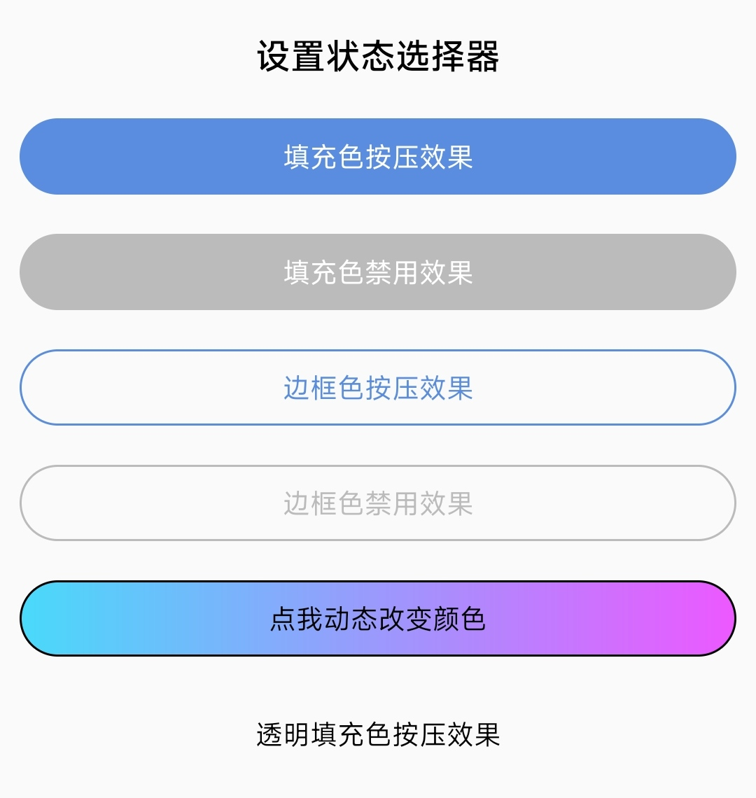
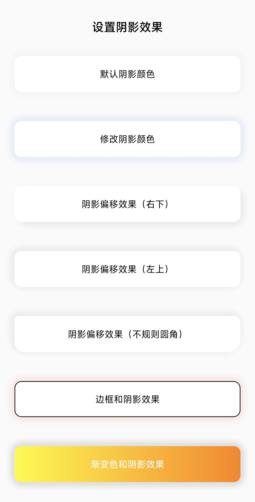
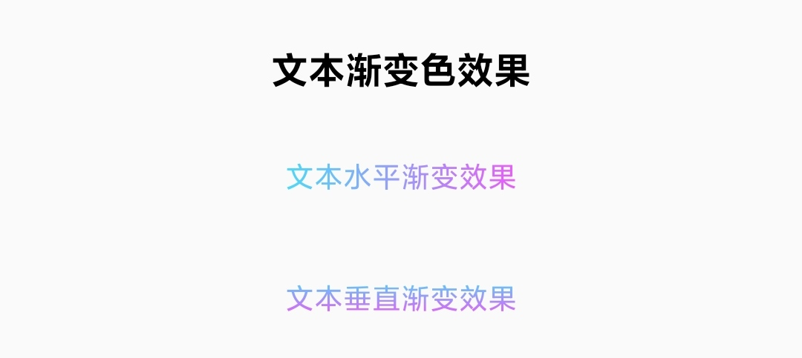
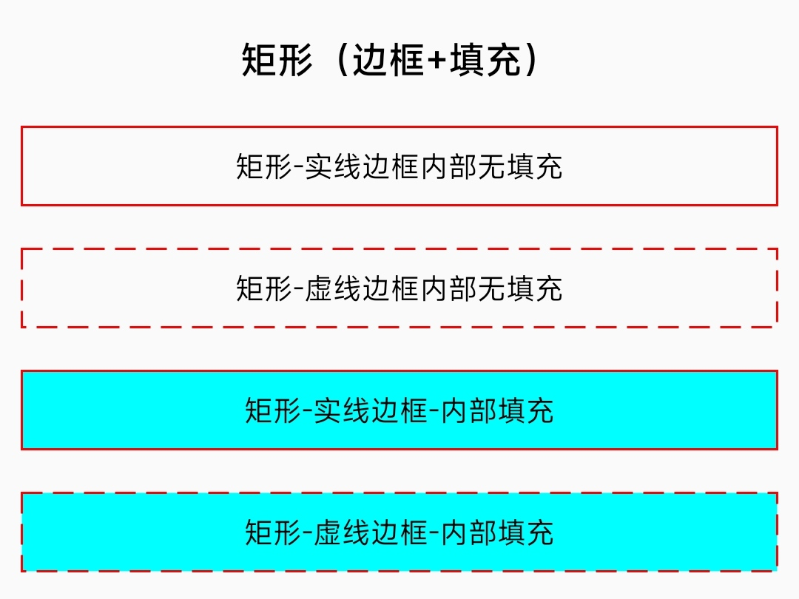
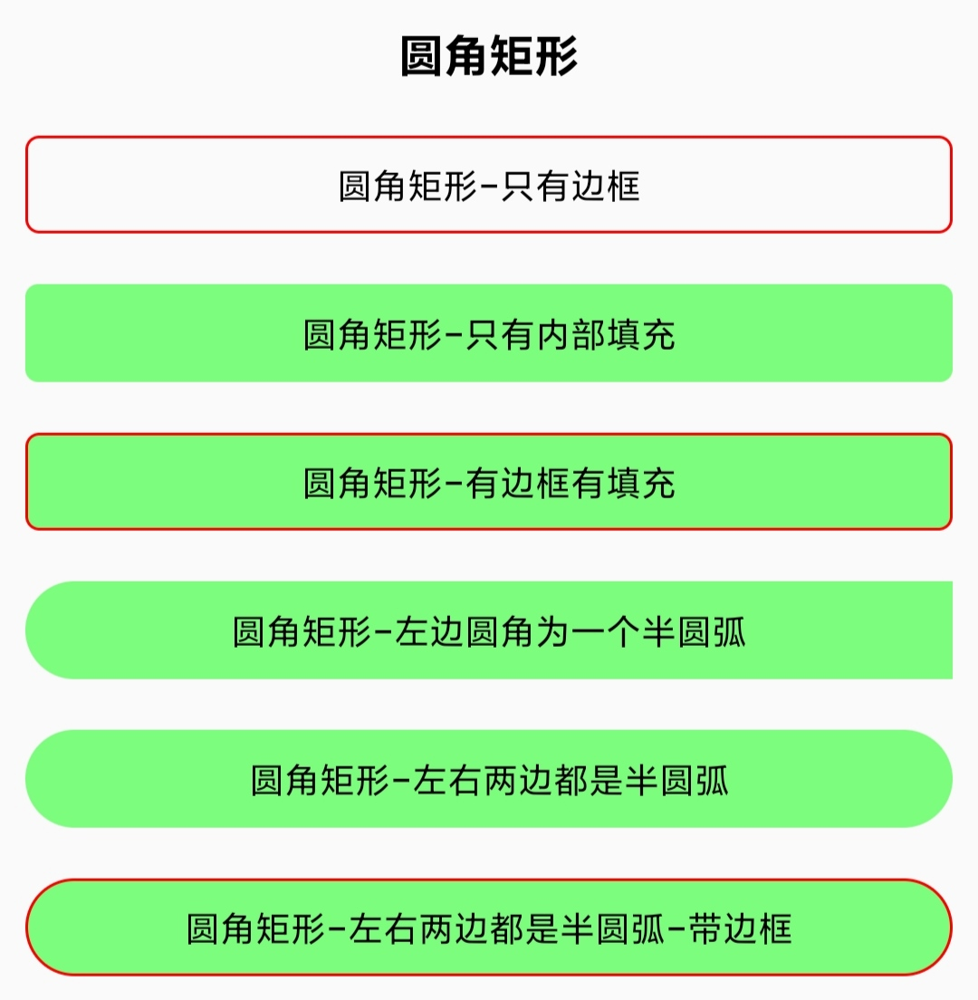
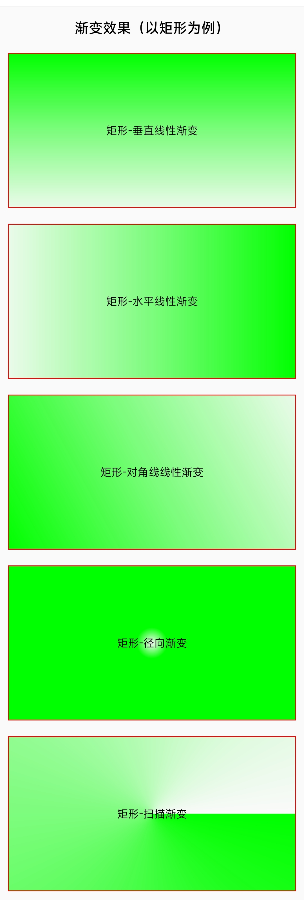
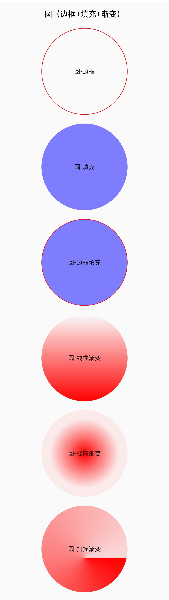
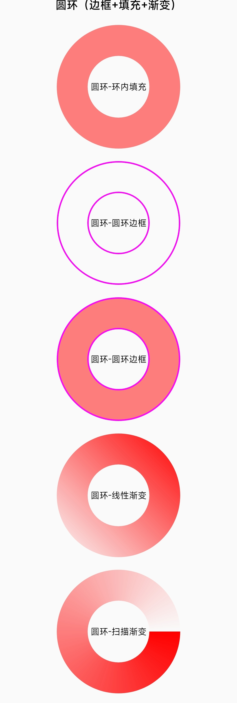
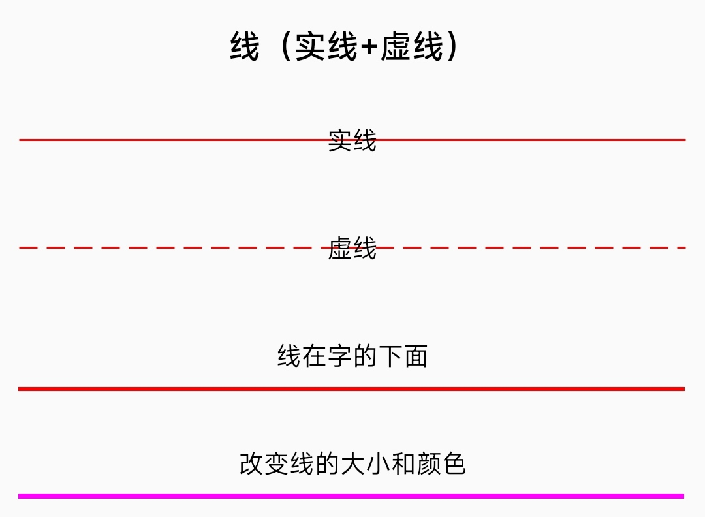

# Shape 框架

* 项目地址：[Github](https://github.com/getActivity/ShapeView)、[码云](https://gitee.com/getActivity/ShapeView)

* 博客介绍：[震惊，没想到 Shape 也可以这么写](https://www.jianshu.com/p/1288d8873440)

* 点击此处 [下载 Demo](ShapeView.apk) 进行演示或者测试

#### 集成步骤

* 在项目根目录下的 `build.gradle` 文件中加入

```groovy
buildscript {
    repositories {
        maven { url 'https://jitpack.io' }
    }
}
allprojects {
    repositories {
        maven { url 'https://jitpack.io' }
    }
}
```

* 在项目 app 模块下的 `build.gradle` 文件中加入

```groovy
android {
    // 支持 JDK 1.8
    compileOptions {
        targetCompatibility JavaVersion.VERSION_1_8
        sourceCompatibility JavaVersion.VERSION_1_8
    }
}

dependencies {
    // Shape 框架：https://github.com/getActivity/ShapeView
    implementation 'com.github.getActivity:ShapeView:5.2'
}
```

#### AndroidX

* 如果项目是基于 **AndroidX** 包，请在项目 `gradle.properties` 文件中加入

```groovy
# 表示将第三方库迁移到 AndroidX
android.enableJetifier = true
```

* 如果项目是基于 **Support** 包则不需要加入此配置

#### 框架文档

```xml
<resources>

    <!-- Shape 形状（默认是矩形） -->
    <attr name="shape">
        <!-- 矩形 -->
        <enum name="rectangle" value="0" />
        <!-- 椭圆形 -->
        <enum name="oval" value="1" />
        <!-- 线条 -->
        <enum name="line" value="2" />
        <!-- 圆环 -->
        <enum name="ring" value="3" />
    </attr>
    <!-- Shape 宽度 -->
    <attr name="shape_width" format="dimension" />
    <!-- Shape 高度 -->
    <attr name="shape_height" format="dimension" />

    <!-- 填充色（默认状态） -->
    <attr name="shape_solidColor" format="color|reference" />
    <!-- 填充色（按下状态） -->
    <attr name="shape_solidPressedColor" format="color|reference" />
    <!-- 填充色（选中状态） -->
    <attr name="shape_solidCheckedColor" format="color|reference" />
    <!-- 填充色（禁用状态） -->
    <attr name="shape_solidDisabledColor" format="color|reference" />
    <!-- 填充色（焦点状态） -->
    <attr name="shape_solidFocusedColor" format="color|reference" />
    <!-- 填充色（选择状态） -->
    <attr name="shape_solidSelectedColor" format="color|reference" />

    <!-- 圆角大小 -->
    <attr name="shape_radius" format="dimension" />
    <!-- 左上角的圆角大小 -->
    <attr name="shape_topLeftRadius" format="dimension" />
    <!-- 右下角的圆角大小 -->
    <attr name="shape_topRightRadius" format="dimension" />
    <!-- 左下角的圆角大小 -->
    <attr name="shape_bottomLeftRadius" format="dimension" />
    <!-- 右下角的圆角大小 -->
    <attr name="shape_bottomRightRadius" format="dimension" />

    <!-- 渐变色起始颜色 -->
    <attr name="shape_startColor" format="color" />
    <!-- 渐变色中间颜色（可不设置） -->
    <attr name="shape_centerColor" format="color" />
    <!-- 渐变色结束颜色 -->
    <attr name="shape_endColor" format="color" />
    <!-- 是否将用于缩放渐变 -->
    <attr name="shape_useLevel" format="boolean" />
    <!-- 渐变角度（仅用于线性渐变。必须是 0-315 范围内的值，并且是 45 的倍数） -->
    <attr name="shape_angle" format="float" />
    <!-- 渐变类型（默认类型是线性渐变） -->
    <attr name="shape_gradientType">
        <!-- 线性渐变 -->
        <enum name="linear" value="0" />
        <!-- 径向渐变 -->
        <enum name="radial" value="1" />
        <!-- 扫描渐变 -->
        <enum name="sweep"  value="2" />
    </attr>
    <!-- 渐变中心 X 点坐标的相对位置（默认值为 0.5）-->
    <attr name="shape_centerX" format="float|fraction" />
    <!-- 渐变中心 Y 点坐标的相对位置（默认值为 0.5）-->
    <attr name="shape_centerY" format="float|fraction" />
    <!-- 渐变色半径（仅用于径向渐变） -->
    <attr name="shape_gradientRadius" format="float|fraction|dimension" />

    <!-- 边框色（默认状态） -->
    <attr name="shape_strokeColor" format="color|reference" />
    <!-- 边框色（按下状态） -->
    <attr name="shape_strokePressedColor" format="color|reference" />
    <!-- 边框色（选中状态） -->
    <attr name="shape_strokeCheckedColor" format="color|reference" />
    <!-- 边框色（禁用状态） -->
    <attr name="shape_strokeDisabledColor" format="color|reference" />
    <!-- 边框色（焦点状态） -->
    <attr name="shape_strokeFocusedColor" format="color|reference" />
    <!-- 边框色（选择状态） -->
    <attr name="shape_strokeSelectedColor" format="color|reference" />

    <!-- 边框宽度 -->
    <attr name="shape_strokeWidth" format="dimension" />
    <!-- 边框虚线宽度（为 0 就是实线，大于 0 就是虚线） -->
    <attr name="shape_dashWidth" format="dimension" />
    <!-- 边框虚线间隔（虚线与虚线之间的间隔） -->
    <attr name="shape_dashGap" format="dimension" />

    <!-- 内环的半径（仅在 shape="ring" 生效） -->
    <attr name="shape_innerRadius" format="dimension" />
    <!-- 内环的半径比率（仅在 shape="ring" 生效），计算公式：整个圆环 / innerRadiusRatio = innerRadius -->
    <attr name="shape_innerRadiusRatio" format="float" />
    <!-- 外环的厚度（仅在 shape="ring" 生效） -->
    <attr name="shape_thickness" format="dimension" />
    <!-- 外环的厚度比率（仅在 shape="ring" 生效），计算公式：整个圆环 / thicknessRatio = thickness -->
    <attr name="shape_thicknessRatio" format="float" />

    <!-- 阴影大小 -->
    <attr name="shape_shadowSize" format="dimension" />
    <!-- 阴影颜色 -->
    <attr name="shape_shadowColor" format="color" />
    <!-- 阴影水平偏移 -->
    <attr name="shape_shadowOffsetX" format="dimension" />
    <!-- 阴影垂直偏移 -->
    <attr name="shape_shadowOffsetY" format="dimension" />

    <!-- 文本色（默认状态） -->
    <attr name="shape_textColor" format="color|reference" />
    <!-- 文本色（按下状态） -->
    <attr name="shape_textPressedColor" format="color|reference" />
    <!-- 文本色（选中状态） -->
    <attr name="shape_textCheckedColor" format="color|reference" />
    <!-- 文本色（禁用状态） -->
    <attr name="shape_textDisabledColor" format="color|reference" />
    <!-- 文本色（焦点状态） -->
    <attr name="shape_textFocusedColor" format="color|reference" />
    <!-- 文本色（选择状态） -->
    <attr name="shape_textSelectedColor" format="color|reference" />

    <!-- 文本渐变色起始颜色 -->
    <attr name="shape_textStartColor" format="color" />
    <!-- 文本渐变色中间颜色（可不设置） -->
    <attr name="shape_textCenterColor" format="color" />
    <!-- 文本渐变色结束颜色 -->
    <attr name="shape_textEndColor" format="color" />
    <!-- 文本渐变方向（默认类型是水平渐变） -->
    <attr name="shape_textGradientOrientation">
        <!-- 水平渐变 -->
        <enum name="horizontal" value="0" />
        <!-- 垂直渐变 -->
        <enum name="vertical" value="1" />
    </attr>

</resources>
```

#### 使用案例



```xml
<com.hjq.shape.view.ShapeButton
    android:layout_width="match_parent"
    android:layout_height="wrap_content"
    android:layout_margin="10dp"
    android:clickable="true"
    android:gravity="center"
    android:padding="10dp"
    android:text="填充色按压效果"
    android:textColor="@android:color/white"
    android:textSize="14sp"
    app:shape="rectangle"
    app:shape_radius="20dp"
    app:shape_solidColor="#5A8DDF"
    app:shape_solidPressedColor="#AA5A8DDF" />

<com.hjq.shape.view.ShapeButton
    android:layout_width="match_parent"
    android:layout_height="wrap_content"
    android:layout_margin="10dp"
    android:enabled="false"
    android:gravity="center"
    android:padding="10dp"
    android:text="填充色禁用效果"
    android:textColor="@android:color/white"
    android:textSize="14sp"
    app:shape="rectangle"
    app:shape_radius="20dp"
    app:shape_solidColor="#5A8DDF"
    app:shape_solidDisabledColor="#BBBBBB" />

<com.hjq.shape.view.ShapeButton
    android:layout_width="match_parent"
    android:layout_height="wrap_content"
    android:layout_margin="10dp"
    android:clickable="true"
    android:gravity="center"
    android:padding="10dp"
    android:text="边框色按压效果"
    android:textSize="14sp"
    app:shape="rectangle"
    app:shape_radius="20dp"
    app:shape_solidPressedColor="#5A8DDF"
    app:shape_strokeColor="#5A8DDF"
    app:shape_strokeWidth="1dp"
    app:shape_textColor="#5A8DDF"
    app:shape_textPressedColor="@android:color/white" />

<com.hjq.shape.view.ShapeButton
    android:layout_width="match_parent"
    android:layout_height="wrap_content"
    android:layout_margin="10dp"
    android:enabled="false"
    android:gravity="center"
    android:padding="10dp"
    android:text="边框色禁用效果"
    android:textSize="14sp"
    app:shape="rectangle"
    app:shape_radius="20dp"
    app:shape_strokeColor="#5A8DDF"
    app:shape_strokeDisabledColor="#BBBBBB"
    app:shape_strokeWidth="1dp"
    app:shape_textColor="@android:color/black"
    app:shape_textDisabledColor="#BBBBBB" />
```



```xml
<com.hjq.shape.view.ShapeTextView
    android:layout_width="match_parent"
    android:layout_height="wrap_content"
    android:layout_margin="10dp"
    android:clickable="true"
    android:gravity="center"
    android:paddingTop="30dp"
    android:paddingBottom="30dp"
    android:text="默认阴影颜色"
    android:textColor="@android:color/black"
    android:textSize="14sp"
    app:shape="rectangle"
    app:shape_radius="10dp"
    app:shape_shadowColor="#20000000"
    app:shape_shadowSize="10dp"
    app:shape_solidColor="#FFFFFF" />

<com.hjq.shape.view.ShapeTextView
    android:layout_width="match_parent"
    android:layout_height="wrap_content"
    android:layout_margin="10dp"
    android:gravity="center"
    android:paddingTop="30dp"
    android:paddingBottom="30dp"
    android:text="修改阴影颜色"
    android:textColor="@android:color/black"
    android:textSize="14sp"
    app:shape="rectangle"
    app:shape_radius="10dp"
    app:shape_shadowColor="#AA5A8DDF"
    app:shape_shadowSize="10dp"
    app:shape_solidColor="#FFFFFF" />

<com.hjq.shape.view.ShapeTextView
    android:layout_width="match_parent"
    android:layout_height="wrap_content"
    android:layout_margin="10dp"
    android:clickable="true"
    android:gravity="center"
    android:paddingTop="30dp"
    android:paddingBottom="30dp"
    android:text="阴影偏移效果"
    android:textColor="@android:color/black"
    android:textSize="14sp"
    app:shape="rectangle"
    app:shape_radius="10dp"
    app:shape_shadowColor="#50000000"
    app:shape_shadowOffsetX="5dp"
    app:shape_shadowOffsetY="5dp"
    app:shape_shadowSize="10dp"
    app:shape_solidColor="#FFFFFF" />
```



```xml
<com.hjq.shape.view.ShapeTextView
    android:layout_width="wrap_content"
    android:layout_height="wrap_content"
    android:layout_margin="10dp"
    android:gravity="center"
    android:padding="10dp"
    android:text="文本水平渐变效果"
    android:textSize="14sp"
    app:shape_textEndColor="#ED58FF"
    app:shape_textGradientOrientation="horizontal"
    app:shape_textStartColor="#49DAFA" />

<com.hjq.shape.view.ShapeTextView
    android:layout_width="wrap_content"
    android:layout_height="wrap_content"
    android:layout_margin="10dp"
    android:gravity="center"
    android:padding="10dp"
    android:text="文本垂直渐变效果"
    android:textSize="14sp"
    app:shape_textEndColor="#ED58FF"
    app:shape_textGradientOrientation="vertical"
    app:shape_textStartColor="#49DAFA" />
```



```xml
<com.hjq.shape.view.ShapeTextView
    android:layout_width="match_parent"
    android:layout_height="wrap_content"
    android:layout_margin="10dp"
    android:gravity="center"
    android:padding="10dp"
    android:text="矩形实线边框内部无填充"
    android:textColor="@android:color/black"
    android:textSize="14sp"
    app:shape="rectangle"
    app:shape_strokeColor="#ffff0000"
    app:shape_strokeWidth="1dp" />

<com.hjq.shape.view.ShapeTextView
    android:layout_width="match_parent"
    android:layout_height="wrap_content"
    android:layout_margin="10dp"
    android:gravity="center"
    android:padding="10dp"
    android:text="矩形虚线边框内部无填充"
    android:textColor="@android:color/black"
    android:textSize="14sp"
    app:shape="rectangle"
    app:shape_dashGap="5dp"
    app:shape_dashWidth="10dp"
    app:shape_strokeColor="#ffff0000"
    app:shape_strokeWidth="1dp" />

<com.hjq.shape.view.ShapeTextView
    android:layout_width="match_parent"
    android:layout_height="wrap_content"
    android:layout_margin="10dp"
    android:gravity="center"
    android:padding="10dp"
    android:text="矩形实线边框-内部填充"
    android:textColor="@android:color/black"
    android:textSize="14sp"
    app:shape="rectangle"
    app:shape_solidColor="#ff00ffff"
    app:shape_strokeColor="#ffff0000"
    app:shape_strokeWidth="1dp" />

<com.hjq.shape.view.ShapeTextView
    android:layout_width="match_parent"
    android:layout_height="wrap_content"
    android:layout_margin="10dp"
    android:gravity="center"
    android:padding="10dp"
    android:text="矩形虚线边框-内部填充"
    android:textColor="@android:color/black"
    android:textSize="14sp"
    app:shape="rectangle"
    app:shape_dashGap="5dp"
    app:shape_dashWidth="10dp"
    app:shape_solidColor="#ff00ffff"
    app:shape_strokeColor="#ffff0000"
    app:shape_strokeWidth="1dp" />
```



```xml
<com.hjq.shape.view.ShapeTextView
    android:layout_width="match_parent"
    android:layout_height="wrap_content"
    android:layout_margin="10dp"
    android:gravity="center"
    android:padding="10dp"
    android:text="圆角矩形-只有边框"
    android:textColor="@android:color/black"
    android:textSize="14sp"
    app:shape="rectangle"
    app:shape_radius="5dp"
    app:shape_strokeColor="#ffff0000"
    app:shape_strokeWidth="1dp" />

<com.hjq.shape.view.ShapeTextView
    android:layout_width="match_parent"
    android:layout_height="wrap_content"
    android:layout_margin="10dp"
    android:gravity="center"
    android:padding="10dp"
    android:text="圆角矩形-只有内部填充"
    android:textColor="@android:color/black"
    android:textSize="14sp"
    app:shape="rectangle"
    app:shape_radius="5dp"
    app:shape_solidColor="#8000ff00" />

<com.hjq.shape.view.ShapeTextView
    android:layout_width="match_parent"
    android:layout_height="wrap_content"
    android:layout_margin="10dp"
    android:gravity="center"
    android:padding="10dp"
    android:text="圆角矩形-有边框有填充"
    android:textColor="@android:color/black"
    android:textSize="14sp"
    app:shape="rectangle"
    app:shape_radius="5dp"
    app:shape_solidColor="#8000ff00"
    app:shape_strokeColor="#ffff0000"
    app:shape_strokeWidth="1dp" />

<com.hjq.shape.view.ShapeTextView
    android:layout_width="match_parent"
    android:layout_height="wrap_content"
    android:layout_margin="10dp"
    android:gravity="center"
    android:padding="10dp"
    android:text="圆角矩形-左边圆角为一个半圆弧"
    android:textColor="@android:color/black"
    android:textSize="14sp"
    app:shape="rectangle"
    app:shape_bottomLeftRadius="20dp"
    app:shape_solidColor="#8000ff00"
    app:shape_topLeftRadius="20dp" />

<com.hjq.shape.view.ShapeTextView
    android:layout_width="match_parent"
    android:layout_height="wrap_content"
    android:layout_margin="10dp"
    android:gravity="center"
    android:padding="10dp"
    android:text="圆角矩形-左右两边都是半圆弧"
    android:textColor="@android:color/black"
    android:textSize="14sp"
    app:shape="rectangle"
    app:shape_radius="20dp"
    app:shape_solidColor="#8000ff00" />

<com.hjq.shape.view.ShapeTextView
    android:layout_width="match_parent"
    android:layout_height="wrap_content"
    android:layout_margin="10dp"
    android:gravity="center"
    android:padding="10dp"
    android:text="圆角矩形-左右两边都是半圆弧-带边框"
    android:textColor="@android:color/black"
    android:textSize="14sp"
    app:shape="rectangle"
    app:shape_radius="20dp"
    app:shape_solidColor="#8000ff00"
    app:shape_strokeColor="#ffff0000"
    app:shape_strokeWidth="1dp" />
```



```xml
<com.hjq.shape.view.ShapeTextView
    android:layout_width="match_parent"
    android:layout_height="200dp"
    android:layout_margin="10dp"
    android:gravity="center"
    android:padding="10dp"
    android:text="垂直线性渐变"
    android:textColor="@android:color/black"
    android:textSize="14sp"
    app:shape="rectangle"
    app:shape_angle="-45"
    app:shape_centerColor="#8000ff00"
    app:shape_centerX="0.5"
    app:shape_centerY="0.4"
    app:shape_endColor="#1000ff00"
    app:shape_startColor="#ff00ff00"
    app:shape_strokeColor="#ffff0000"
    app:shape_strokeWidth="1dp" />

<com.hjq.shape.view.ShapeTextView
    android:layout_width="match_parent"
    android:layout_height="200dp"
    android:layout_margin="10dp"
    android:gravity="center"
    android:padding="10dp"
    android:text="水平线性渐变"
    android:textColor="@android:color/black"
    android:textSize="14sp"
    app:shape="rectangle"
    app:shape_angle="0"
    app:shape_centerColor="#8000ff00"
    app:shape_centerX="0.5"
    app:shape_centerY="0.5"
    app:shape_endColor="#ff00ff00"
    app:shape_startColor="#1000ff00"
    app:shape_strokeColor="#ffff0000"
    app:shape_strokeWidth="1dp" />

<com.hjq.shape.view.ShapeTextView
    android:layout_width="match_parent"
    android:layout_height="200dp"
    android:layout_margin="10dp"
    android:gravity="center"
    android:padding="10dp"
    android:text="对角线线性渐变"
    android:textColor="@android:color/black"
    android:textSize="14sp"
    app:shape="rectangle"
    app:shape_angle="45"
    app:shape_centerColor="#8000ff00"
    app:shape_centerX="0.5"
    app:shape_centerY="0.5"
    app:shape_endColor="#1000ff00"
    app:shape_startColor="#ff00ff00"
    app:shape_strokeColor="#ffff0000"
    app:shape_strokeWidth="1dp" />

<com.hjq.shape.view.ShapeTextView
    android:layout_width="match_parent"
    android:layout_height="200dp"
    android:layout_margin="10dp"
    android:gravity="center"
    android:padding="10dp"
    android:text="径向渐变"
    android:textColor="@android:color/black"
    android:textSize="14sp"
    app:shape="rectangle"
    app:shape_angle="0"
    app:shape_centerX="0.5"
    app:shape_centerY="0.5"
    app:shape_endColor="#ff00ff00"
    app:shape_gradientRadius="20dp"
    app:shape_gradientType="radial"
    app:shape_startColor="#0000ff00"
    app:shape_strokeColor="#ffff0000"
    app:shape_strokeWidth="1dp" />

<com.hjq.shape.view.ShapeTextView
    android:layout_width="match_parent"
    android:layout_height="200dp"
    android:layout_margin="10dp"
    android:gravity="center"
    android:padding="10dp"
    android:text="扫描渐变"
    android:textColor="@android:color/black"
    android:textSize="14sp"
    app:shape="rectangle"
    app:shape_angle="0"
    app:shape_centerX="0.5"
    app:shape_centerY="0.5"
    app:shape_endColor="#0000ff00"
    app:shape_gradientType="sweep"
    app:shape_startColor="#ff00ff00"
    app:shape_strokeColor="#ffff0000"
    app:shape_strokeWidth="1dp" />
```



```xml
<com.hjq.shape.view.ShapeTextView
    android:layout_width="200dp"
    android:layout_height="200dp"
    android:layout_margin="10dp"
    android:gravity="center"
    android:padding="10dp"
    android:text="圆-边框"
    android:textColor="@android:color/black"
    android:textSize="14sp"
    app:shape="oval"
    app:shape_strokeColor="#ffff0000"
    app:shape_strokeWidth="1dp" />

<com.hjq.shape.view.ShapeTextView
    android:layout_width="200dp"
    android:layout_height="200dp"
    android:layout_margin="10dp"
    android:gravity="center"
    android:padding="10dp"
    android:text="圆-填充"
    android:textColor="@android:color/black"
    android:textSize="14sp"
    app:shape="oval"
    app:shape_solidColor="#800000ff" />

<com.hjq.shape.view.ShapeTextView
    android:layout_width="200dp"
    android:layout_height="200dp"
    android:layout_margin="10dp"
    android:gravity="center"
    android:padding="10dp"
    android:text="圆-边框填充"
    android:textColor="@android:color/black"
    android:textSize="14sp"
    app:shape="oval"
    app:shape_solidColor="#800000ff"
    app:shape_strokeColor="#ffff0000"
    app:shape_strokeWidth="1dp" />

<com.hjq.shape.view.ShapeTextView
    android:layout_width="200dp"
    android:layout_height="200dp"
    android:layout_margin="10dp"
    android:gravity="center"
    android:padding="10dp"
    android:text="线性渐变"
    android:textColor="@android:color/black"
    android:textSize="14sp"
    app:shape="oval"
    app:shape_angle="-90"
    app:shape_centerColor="#80ff0000"
    app:shape_centerX="0.5"
    app:shape_centerY="0.8"
    app:shape_endColor="#ffff0000"
    app:shape_gradientType="linear"
    app:shape_startColor="#00ff0000" />

<com.hjq.shape.view.ShapeTextView
    android:layout_width="200dp"
    android:layout_height="200dp"
    android:layout_margin="10dp"
    android:gravity="center"
    android:padding="10dp"
    android:text="径向渐变"
    android:textColor="@android:color/black"
    android:textSize="14sp"
    app:shape="oval"
    app:shape_centerColor="#80ff0000"
    app:shape_centerX="0.5"
    app:shape_centerY="0.5"
    app:shape_endColor="#10ff0000"
    app:shape_gradientRadius="80dp"
    app:shape_gradientType="radial"
    app:shape_startColor="#ffff0000" />

<com.hjq.shape.view.ShapeTextView
    android:layout_width="200dp"
    android:layout_height="200dp"
    android:layout_margin="10dp"
    android:gravity="center"
    android:padding="10dp"
    android:text="扫描渐变"
    android:textColor="@android:color/black"
    android:textSize="14sp"
    app:shape="oval"
    app:shape_centerColor="#80ff0000"
    app:shape_centerX="0.5"
    app:shape_centerY="0.6"
    app:shape_endColor="#20ff0000"
    app:shape_gradientRadius="20dp"
    app:shape_gradientType="sweep"
    app:shape_startColor="#ffff0000" />
```



```xml
<com.hjq.shape.view.ShapeTextView
    android:layout_width="200dp"
    android:layout_height="200dp"
    android:layout_margin="10dp"
    android:gravity="center"
    android:padding="10dp"
    android:text="环内填充"
    android:textColor="@android:color/black"
    android:textSize="14sp"
    app:shape="ring"
    app:shape_innerRadiusRatio="4"
    app:shape_thicknessRatio="4"
    app:shape_solidColor="#80ff0000" />

<com.hjq.shape.view.ShapeTextView
    android:layout_width="200dp"
    android:layout_height="200dp"
    android:layout_margin="10dp"
    android:gravity="center"
    android:padding="10dp"
    android:text="圆环边框"
    android:textColor="@android:color/black"
    android:textSize="14sp"
    app:shape="ring"
    app:shape_innerRadiusRatio="4"
    app:shape_thicknessRatio="4"
    app:shape_strokeWidth="2dp"
    app:shape_strokeColor="#ffff00ff" />

<com.hjq.shape.view.ShapeTextView
    android:layout_width="200dp"
    android:layout_height="200dp"
    android:layout_margin="10dp"
    android:gravity="center"
    android:padding="10dp"
    android:text="圆环边框"
    android:textColor="@android:color/black"
    android:textSize="14sp"
    app:shape="ring"
    app:shape_innerRadiusRatio="4"
    app:shape_thicknessRatio="4"
    app:shape_solidColor="#80ff0000"
    app:shape_strokeWidth="2dp"
    app:shape_strokeColor="#ffff00ff" />

<com.hjq.shape.view.ShapeTextView
    android:layout_width="200dp"
    android:layout_height="200dp"
    android:layout_margin="10dp"
    android:gravity="center"
    android:padding="10dp"
    android:text="线性渐变"
    android:textColor="@android:color/black"
    android:textSize="14sp"
    app:shape="ring"
    app:shape_innerRadiusRatio="4"
    app:shape_thicknessRatio="4"
    app:shape_angle="45"
    app:shape_centerColor="#80ff0000"
    app:shape_endColor="#ffff0000"
    app:shape_startColor="#00ff0000"
    app:shape_gradientType="linear" />

<com.hjq.shape.view.ShapeTextView
    android:layout_width="200dp"
    android:layout_height="200dp"
    android:layout_margin="10dp"
    android:gravity="center"
    android:padding="10dp"
    android:text="扫描渐变"
    android:textColor="@android:color/black"
    android:textSize="14sp"
    app:shape="ring"
    app:shape_innerRadiusRatio="4"
    app:shape_thicknessRatio="4"
    app:shape_centerColor="#80ff0000"
    app:shape_endColor="#00ff0000"
    app:shape_startColor="#ffff0000"
    app:shape_gradientType="sweep" />
```



```xml
<com.hjq.shape.view.ShapeTextView
    android:layout_width="match_parent"
    android:layout_height="wrap_content"
    android:layout_margin="10dp"
    android:gravity="center"
    android:padding="10dp"
    android:text="实线"
    android:textColor="@android:color/black"
    android:textSize="14sp"
    app:shape="line"
    app:shape_strokeColor="#ffff0000"
    app:shape_strokeWidth="1dp"/>

<com.hjq.shape.view.ShapeTextView
    android:layout_width="match_parent"
    android:layout_height="wrap_content"
    android:layout_margin="10dp"
    android:gravity="center"
    android:padding="10dp"
    android:text="虚线"
    android:textColor="@android:color/black"
    android:textSize="14sp"
    app:shape="line"
    app:shape_dashGap="5dp"
    app:shape_dashWidth="10dp"
    app:shape_strokeColor="#ffff0000"
    app:shape_strokeWidth="1dp"/>
```

* 目前支持的控件有：

    * View：ShapeView、ShapeTextView、ShapeButton、ShapeImageView、ShapeRadioButton、ShapeCheckBox、ShapeEditText

    * Layout：ShapeLinearLayout、ShapeFrameLayout、ShapeRelativeLayout、ShapeConstraintLayout、ShapeRecyclerView

#### 框架亮点

* 更加便捷：无需新增 Xml 文件，直接定义控件属性即可

* 即时生效：在布局中可实时预览效果，即见所得

* 无学习成本：控件属性和原生 Shape 命名保持一致，无需额外学习

* 覆盖范围广：几乎涵盖所有常见的 View 控件，并且控件名称无任何记忆成本

* 支持状态选择器：不仅支持设置背景色的状态选择器，还支持设置文本颜色的状态选择器

* 功能覆盖全面：不仅支持设置背景阴影色，还支持设置文本渐变色

#### 作者的其他开源项目

* 安卓技术中台：[AndroidProject](https://github.com/getActivity/AndroidProject)

* 权限框架：[XXPermissions](https://github.com/getActivity/XXPermissions)

* 吐司框架：[ToastUtils](https://github.com/getActivity/ToastUtils)

* 网络框架：[EasyHttp](https://github.com/getActivity/EasyHttp)

* 标题栏框架：[TitleBar](https://github.com/getActivity/TitleBar)

* 国际化框架：[MultiLanguages](https://github.com/getActivity/MultiLanguages)

* 悬浮窗框架：[XToast](https://github.com/getActivity/XToast)

* Gson 解析容错：[GsonFactory](https://github.com/getActivity/GsonFactory)

* 日志查看框架：[Logcat](https://github.com/getActivity/Logcat)

#### 微信公众号：Android轮子哥


#### Android 技术分享 QQ 群：78797078

#### 如果您觉得我的开源库帮你节省了大量的开发时间，请扫描下方的二维码随意打赏，要是能打赏个 10.24 :monkey_face:就太:thumbsup:了。您的支持将鼓励我继续创作:octocat:

 

#### [点击查看捐赠列表](https://github.com/getActivity/Donate)

## License

```text
Copyright 2021 Huang JinQun

Licensed under the Apache License, Version 2.0 (the "License");
you may not use this file except in compliance with the License.
You may obtain a copy of the License at

   http://www.apache.org/licenses/LICENSE-2.0

Unless required by applicable law or agreed to in writing, software
distributed under the License is distributed on an "AS IS" BASIS,
WITHOUT WARRANTIES OR CONDITIONS OF ANY KIND, either express or implied.
See the License for the specific language governing permissions and
limitations under the License.
```