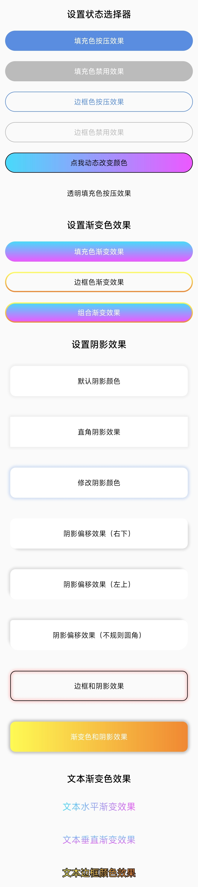

# ShapeView 框架

* 项目地址：[Github](https://github.com/getActivity/ShapeView)

* 博客介绍：[震惊，没想到 Shape 也可以这么写](https://www.jianshu.com/p/1288d8873440)

* 可以扫码下载 Demo 进行演示或者测试，如果扫码下载不了的，[点击此处可直接下载](https://github.com/getActivity/ShapeView/releases/download/9.6/ShapeView.apk)




#### 集成步骤

* 如果你的项目 Gradle 配置是在 `7.0 以下`，需要在 `build.gradle` 文件中加入

```groovy
allprojects {
    repositories {
        // JitPack 远程仓库：https://jitpack.io
        maven { url 'https://jitpack.io' }
    }
}
```

* 如果你的 Gradle 配置是 `7.0 及以上`，则需要在 `settings.gradle` 文件中加入

```groovy
dependencyResolutionManagement {
    repositories {
        // JitPack 远程仓库：https://jitpack.io
        maven { url 'https://jitpack.io' }
    }
}
```

* 配置完远程仓库后，在项目 app 模块下的 `build.gradle` 文件中加入远程依赖

```groovy
android {
    // 支持 JDK 1.8
    compileOptions {
        targetCompatibility JavaVersion.VERSION_1_8
        sourceCompatibility JavaVersion.VERSION_1_8
    }
}

dependencies {
    // ShapeView：https://github.com/getActivity/ShapeView
    implementation 'com.github.getActivity:ShapeView:9.6'
    // ShapeDrawable：https://github.com/getActivity/ShapeDrawable
    implementation 'com.github.getActivity:ShapeDrawable:3.3'
}
```

#### AndroidX 兼容

* 如果项目是基于 **AndroidX** 包，请在项目 `gradle.properties` 文件中加入

```text
# 表示将第三方库迁移到 AndroidX
android.enableJetifier = true
```

* 如果项目是基于 **Support** 包则不需要加入此配置

#### 框架文档

* Java 代码设置

```java
ShapeButton shapeButton = findViewById(R.id.btn_main_test);
shapeButton.setOnClickListener(new View.OnClickListener() {
    @Override
    public void onClick(View v) {
    
        shapeButton.getShapeDrawableBuilder()
                .setSolidColor(0xFF000000)
                .setStrokeColor(0xFF5A8DDF)
                // 注意：最后需要调用一下 intoBackground 方法才能生效
                .intoBackground();

        shapeButton.getTextColorBuilder()
                .setTextColor(0xFFFFFFFF)
                // 注意：最后需要调用一下 intoTextColor 方法才能生效
                .intoTextColor();

        shapeButton.setText("颜色已经改变啦");
    }
});
```

#### 布局属性大全

* [不同版本的 xml 属性适配请点击这里查看](Adaptive.md)

```xml
<resources>

    <!-- Shape 形状（默认是矩形） -->
    <attr name="shape_type">
        <!-- 矩形 -->
        <enum name="rectangle" value="0" />
        <!-- 椭圆形 -->
        <enum name="oval" value="1" />
        <!-- 线条 -->
        <enum name="line" value="2" />
        <!-- 圆环 -->
        <enum name="ring" value="3" />
    </attr>
    
    <!-- Shape 宽度 -->
    <attr name="shape_width" format="dimension" />
    <!-- Shape 高度 -->
    <attr name="shape_height" format="dimension" />

    <!-- 圆角大小 -->
    <attr name="shape_radius" format="dimension" />
    <!-- 左上角的圆角大小 -->
    <attr name="shape_radiusInTopLeft" format="dimension" />
    <attr name="shape_radiusInTopStart" format="dimension" />
    <!-- 右上角的圆角大小 -->
    <attr name="shape_radiusInTopRight" format="dimension" />
    <attr name="shape_radiusInTopEnd" format="dimension" />
    <!-- 左下角的圆角大小 -->
    <attr name="shape_radiusInBottomLeft" format="dimension" />
    <attr name="shape_radiusInBottomStart" format="dimension" />
    <!-- 右下角的圆角大小 -->
    <attr name="shape_radiusInBottomRight" format="dimension" />
    <attr name="shape_radiusInBottomEnd" format="dimension" />

    <!-- 填充色（默认状态） -->
    <attr name="shape_solidColor" format="color" />
    <!-- 填充色（按下状态） -->
    <attr name="shape_solidPressedColor" format="color" />
    <!-- 填充色（选中状态） -->
    <attr name="shape_solidCheckedColor" format="color" />
    <!-- 填充色（禁用状态） -->
    <attr name="shape_solidDisabledColor" format="color" />
    <!-- 填充色（焦点状态） -->
    <attr name="shape_solidFocusedColor" format="color" />
    <!-- 填充色（选择状态） -->
    <attr name="shape_solidSelectedColor" format="color" />

    <!-- 填充色渐变色起始颜色 -->
    <attr name="shape_solidGradientStartColor" format="color" />
    <!-- 填充色渐变色中间颜色（可不设置） -->
    <attr name="shape_solidGradientCenterColor" format="color" />
    <!-- 填充色渐变色结束颜色 -->
    <attr name="shape_solidGradientEndColor" format="color" />

    <!-- 填充色渐变方向（仅用于线性渐变） -->
    <attr name="shape_solidGradientOrientation" >
        <!-- 从左到右绘制渐变（0 度） -->
        <enum name="leftToRight" value="0" />
        <enum name="startToEnd" value="10" />

        <!-- 从右到左绘制渐变（180 度） -->
        <enum name="rightToLeft" value="180" />
        <enum name="endToStart" value="1800" />

        <!-- 从下到上绘制渐变（90 度） -->
        <enum name="bottomToTop" value="90" />
        <!-- 从上到下绘制渐变（270 度） -->
        <enum name="topToBottom" value="270" />

        <!-- 从左上角到右下角绘制渐变（315 度） -->
        <enum name="topLeftToBottomRight" value="315" />
        <enum name="topStartToBottomEnd" value="3150" />

        <!-- 从左下角到右上角绘制渐变（45 度） -->
        <enum name="bottomLeftToTopRight" value="45" />
        <enum name="bottomStartToTopEnd" value="450" />

        <!-- 从右上角到左下角绘制渐变（225 度） -->
        <enum name="topRightToBottomLeft" value="225" />
        <enum name="topEndToBottomStart" value="2250" />

        <!-- 从右下角到左上角绘制渐变（135 度） -->
        <enum name="bottomRightToTopLeft" value="135" />
        <enum name="bottomEndToTopStart" value="1350" />
    </attr>
    <!-- 填充色渐变类型（默认类型是线性渐变） -->
    <attr name="shape_solidGradientType">
        <!-- 线性渐变 -->
        <enum name="linear" value="0" />
        <!-- 径向渐变 -->
        <enum name="radial" value="1" />
        <!-- 扫描渐变 -->
        <enum name="sweep"  value="2" />
    </attr>
    <!-- 填充色渐变中心 X 点坐标的相对位置（默认值为 0.5）-->
    <attr name="shape_solidGradientCenterX" format="float|fraction" />
    <!-- 填充色渐变中心 Y 点坐标的相对位置（默认值为 0.5）-->
    <attr name="shape_solidGradientCenterY" format="float|fraction" />
    <!-- 填充色渐变色半径（仅用于径向渐变） -->
    <attr name="shape_solidGradientRadius" format="float|fraction|dimension" />

    <!-- 边框色（默认状态） -->
    <attr name="shape_strokeColor" format="color" />
    <!-- 边框色（按下状态） -->
    <attr name="shape_strokePressedColor" format="color" />
    <!-- 边框色（选中状态） -->
    <attr name="shape_strokeCheckedColor" format="color" />
    <!-- 边框色（禁用状态） -->
    <attr name="shape_strokeDisabledColor" format="color" />
    <!-- 边框色（焦点状态） -->
    <attr name="shape_strokeFocusedColor" format="color" />
    <!-- 边框色（选择状态） -->
    <attr name="shape_strokeSelectedColor" format="color" />

    <!-- 边框色渐变色起始颜色 -->
    <attr name="shape_strokeGradientStartColor" format="color" />
    <!-- 边框渐变色中间颜色（可不设置） -->
    <attr name="shape_strokeGradientCenterColor" format="color" />
    <!-- 边框渐变色结束颜色 -->
    <attr name="shape_strokeGradientEndColor" format="color" />

    <!-- 边框色渐变方向（仅用于线性渐变） -->
    <attr name="shape_strokeGradientOrientation" >
        <!-- 从左到右绘制渐变（0 度） -->
        <enum name="leftToRight" value="0" />
        <enum name="startToEnd" value="10" />

        <!-- 从右到左绘制渐变（180 度） -->
        <enum name="rightToLeft" value="180" />
        <enum name="endToStart" value="1800" />

        <!-- 从下到上绘制渐变（90 度） -->
        <enum name="bottomToTop" value="90" />
        <!-- 从上到下绘制渐变（270 度） -->
        <enum name="topToBottom" value="270" />

        <!-- 从左上角到右下角绘制渐变（315 度） -->
        <enum name="topLeftToBottomRight" value="315" />
        <enum name="topStartToBottomEnd" value="3150" />

        <!-- 从左下角到右上角绘制渐变（45 度） -->
        <enum name="bottomLeftToTopRight" value="45" />
        <enum name="bottomStartToTopEnd" value="450" />

        <!-- 从右上角到左下角绘制渐变（225 度） -->
        <enum name="topRightToBottomLeft" value="225" />
        <enum name="topEndToBottomStart" value="2250" />

        <!-- 从右下角到左上角绘制渐变（135 度） -->
        <enum name="bottomRightToTopLeft" value="135" />
        <enum name="bottomEndToTopStart" value="1350" />
    </attr>

    <!-- 边框大小 -->
    <attr name="shape_strokeSize" format="dimension" />
    <!-- 边框虚线大小（为 0 就是实线，大于 0 就是虚线） -->
    <attr name="shape_strokeDashSize" format="dimension" />
    <!-- 边框虚线间隔（虚线与虚线之间的间隔） -->
    <attr name="shape_strokeDashGap" format="dimension" />

    <!-- 阴影大小 -->
    <attr name="shape_shadowSize" format="dimension" />
    <!-- 阴影颜色 -->
    <attr name="shape_shadowColor" format="color" />
    <!-- 阴影水平偏移 -->
    <attr name="shape_shadowOffsetX" format="dimension" />
    <!-- 阴影垂直偏移 -->
    <attr name="shape_shadowOffsetY" format="dimension" />

    <!-- 内环的半径（仅在 shape="ring" 生效） -->
    <attr name="shape_ringInnerRadiusSize" format="dimension" />
    <!-- 内环的半径比率（仅在 shape="ring" 生效），计算公式：整个圆环 / innerRadiusRatio = innerRadius -->
    <attr name="shape_ringInnerRadiusRatio" format="float" />
    <!-- 外环的厚度（仅在 shape="ring" 生效） -->
    <attr name="shape_ringThicknessSize" format="dimension" />
    <!-- 外环的厚度比率（仅在 shape="ring" 生效），计算公式：整个圆环 / thicknessRatio = thickness -->
    <attr name="shape_ringThicknessRatio" format="float" />

    <!-- 线条重心（仅在 shape="line" 生效） -->
    <attr name="shape_lineGravity">
        <flag name="top" value="0x30" />
        <flag name="bottom" value="0x50" />
        <flag name="left" value="0x03" />
        <flag name="right" value="0x05" />
        <flag name="start" value="0x00800003" />
        <flag name="end" value="0x00800005" />
        <flag name="center" value="0x11" />
    </attr>

    <!-- 文本色（默认状态） -->
    <attr name="shape_textColor" format="color" />
    <!-- 文本色（按下状态） -->
    <attr name="shape_textPressedColor" format="color" />
    <!-- 文本色（选中状态） -->
    <attr name="shape_textCheckedColor" format="color" />
    <!-- 文本色（禁用状态） -->
    <attr name="shape_textDisabledColor" format="color" />
    <!-- 文本色（焦点状态） -->
    <attr name="shape_textFocusedColor" format="color" />
    <!-- 文本色（选择状态） -->
    <attr name="shape_textSelectedColor" format="color" />

    <!-- 文本渐变色起始颜色 -->
    <attr name="shape_textStartColor" format="color" />
    <!-- 文本渐变色中间颜色（可不设置） -->
    <attr name="shape_textCenterColor" format="color" />
    <!-- 文本渐变色结束颜色 -->
    <attr name="shape_textEndColor" format="color" />
    <!-- 文本渐变方向（默认类型是水平渐变） -->
    <attr name="shape_textGradientOrientation">
        <!-- 水平渐变 -->
        <enum name="horizontal" value="0" />
        <!-- 垂直渐变 -->
        <enum name="vertical" value="1" />
    </attr>

    <!-- 文本边框颜色 -->
    <attr name="shape_textStrokeColor" format="color" />
    <!-- 文本边框大小 -->
    <attr name="shape_textStrokeSize" format="dimension" />

    <!-- CheckBox 或者 RadioButton 图标（默认状态） -->
    <attr name="shape_buttonDrawable" format="reference" />
    <!-- CheckBox 或者 RadioButton 图标（按下状态） -->
    <attr name="shape_buttonPressedDrawable" format="reference" />
    <!-- CheckBox 或者 RadioButton 图标（选中状态） -->
    <attr name="shape_buttonCheckedDrawable" format="reference" />
    <!-- CheckBox 或者 RadioButton 图标（禁用状态） -->
    <attr name="shape_buttonDisabledDrawable" format="reference" />
    <!-- CheckBox 或者 RadioButton 图标（焦点状态） -->
    <attr name="shape_buttonFocusedDrawable" format="reference" />
    <!-- CheckBox 或者 RadioButton 图标（选择状态） -->
    <attr name="shape_buttonSelectedDrawable" format="reference" />

</resources>
```

* 目前支持这些属性的控件有：

    * View 的子类：ShapeView、ShapeTextView、ShapeButton、ShapeImageView、ShapeRadioButton、ShapeCheckBox、ShapeEditText

    * ViewGroup 的子类：ShapeLinearLayout、ShapeFrameLayout、ShapeRelativeLayout、ShapeConstraintLayout、ShapeRecyclerView、ShapeRadioGroup

#### 框架混淆规则

* 在混淆规则文件 `proguard-rules.pro` 中加入

```text
-keep class com.hjq.shape.** {*;}
```

### [常见疑问解答](HelpDoc.md)

### [使用案例文档](UseDemo.md)

#### 框架亮点

* 功能强大：支持设置阴影、边框渐变色、文本渐变色

* 更加便捷：无需新增 Xml 文件，直接定义控件属性即可

* 即时生效：在布局中可实时预览效果，即见所得，无需运行

* 无学习成本：控件属性和原生 Shape 命名保持一致，无需额外学习

* 覆盖范围广：几乎涵盖所有常见的 View 控件，并且控件名称无任何记忆成本

* 支持状态选择器：不仅支持设置背景色的状态选择器，还支持设置文本颜色的状态选择器

#### 作者的其他开源项目

* 安卓技术中台：[AndroidProject](https://github.com/getActivity/AndroidProject)  

* 安卓技术中台 Kt 版：[AndroidProject-Kotlin](https://github.com/getActivity/AndroidProject-Kotlin)  

* 权限框架：[XXPermissions](https://github.com/getActivity/XXPermissions)  

* 吐司框架：[Toaster](https://github.com/getActivity/Toaster)  

* 网络框架：[EasyHttp](https://github.com/getActivity/EasyHttp)  

* 标题栏框架：[TitleBar](https://github.com/getActivity/TitleBar)  

* 悬浮窗框架：[EasyWindow](https://github.com/getActivity/EasyWindow)  

* ShapeDrawable 框架：[ShapeDrawable](https://github.com/getActivity/ShapeDrawable)  

* 语种切换框架：[MultiLanguages](https://github.com/getActivity/MultiLanguages)  

* Gson 解析容错：[GsonFactory](https://github.com/getActivity/GsonFactory)  

* 日志查看框架：[Logcat](https://github.com/getActivity/Logcat)  

* 嵌套滚动布局框架：[NestedScrollLayout](https://github.com/getActivity/NestedScrollLayout)  

* Android 版本适配：[AndroidVersionAdapter](https://github.com/getActivity/AndroidVersionAdapter)  

* Android 代码规范：[AndroidCodeStandard](https://github.com/getActivity/AndroidCodeStandard)  

* Android 资源大汇总：[AndroidIndex](https://github.com/getActivity/AndroidIndex)  

* Android 开源排行榜：[AndroidGithubBoss](https://github.com/getActivity/AndroidGithubBoss)  

* Studio 精品插件：[StudioPlugins](https://github.com/getActivity/StudioPlugins)  

* 表情包大集合：[EmojiPackage](https://github.com/getActivity/EmojiPackage)  

* AI 资源大汇总：[AiIndex](https://github.com/getActivity/AiIndex)  

* 省市区 Json 数据：[ProvinceJson](https://github.com/getActivity/ProvinceJson)  

* Markdown 语法文档：[MarkdownDoc](https://github.com/getActivity/MarkdownDoc)  

#### 微信公众号：Android轮子哥


#### Android 技术 Q 群：10047167

#### 如果您觉得我的开源库帮你节省了大量的开发时间，请扫描下方的二维码随意打赏，要是能打赏个 10.24 :monkey_face:就太:thumbsup:了。您的支持将鼓励我继续创作:octocat:（[点击查看捐赠列表](https://github.com/getActivity/Donate)）

 

## License

```text
Copyright 2021 Huang JinQun

Licensed under the Apache License, Version 2.0 (the "License");
you may not use this file except in compliance with the License.
You may obtain a copy of the License at

   http://www.apache.org/licenses/LICENSE-2.0

Unless required by applicable law or agreed to in writing, software
distributed under the License is distributed on an "AS IS" BASIS,
WITHOUT WARRANTIES OR CONDITIONS OF ANY KIND, either express or implied.
See the License for the specific language governing permissions and
limitations under the License.
```